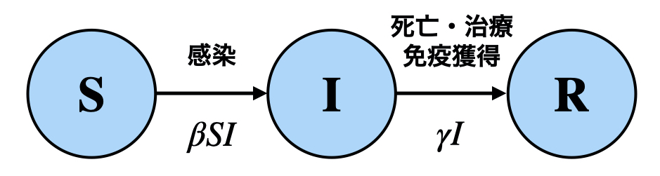
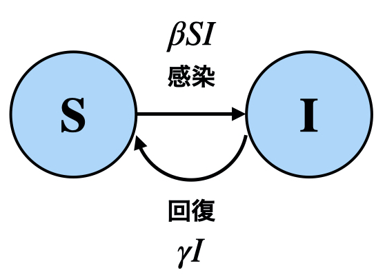
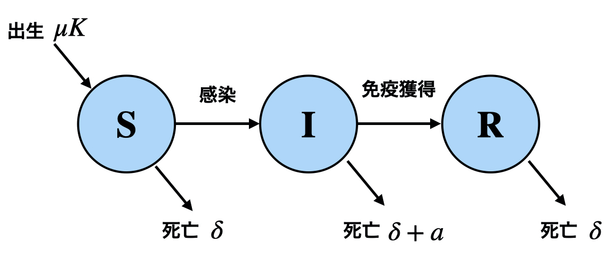
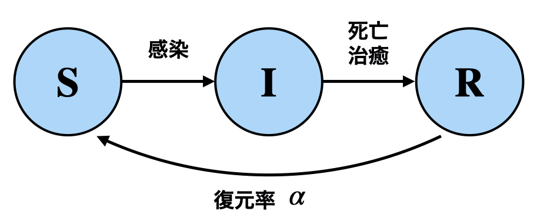
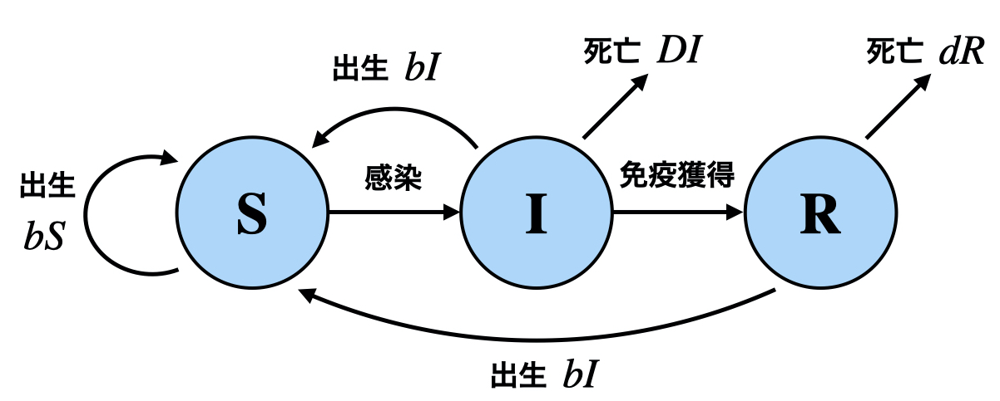
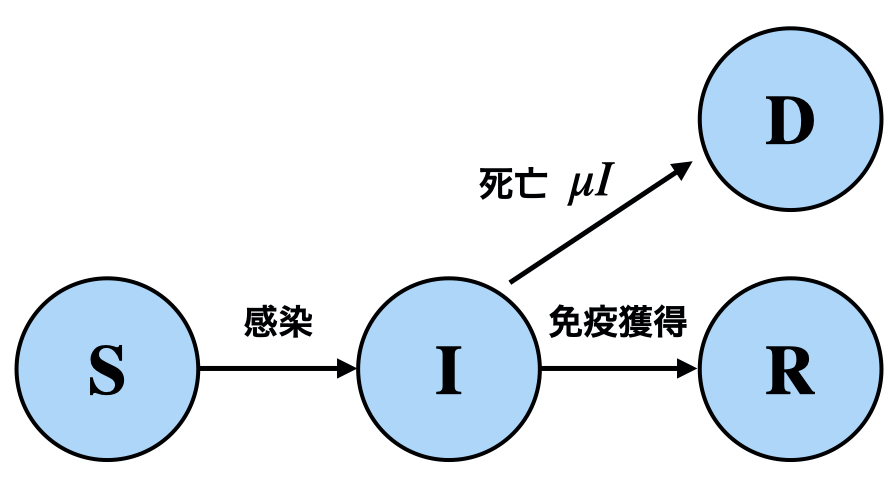
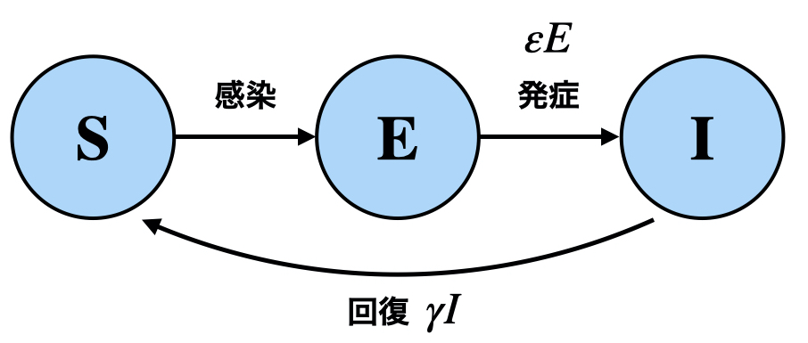
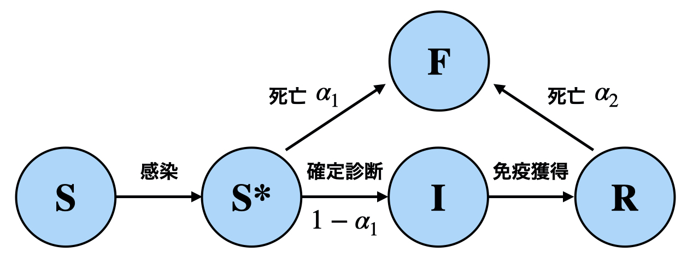
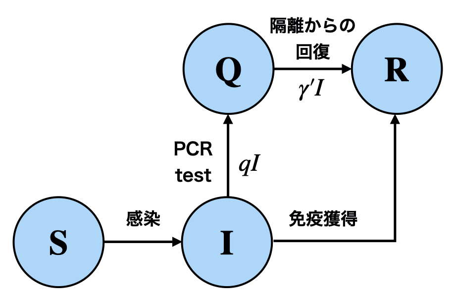
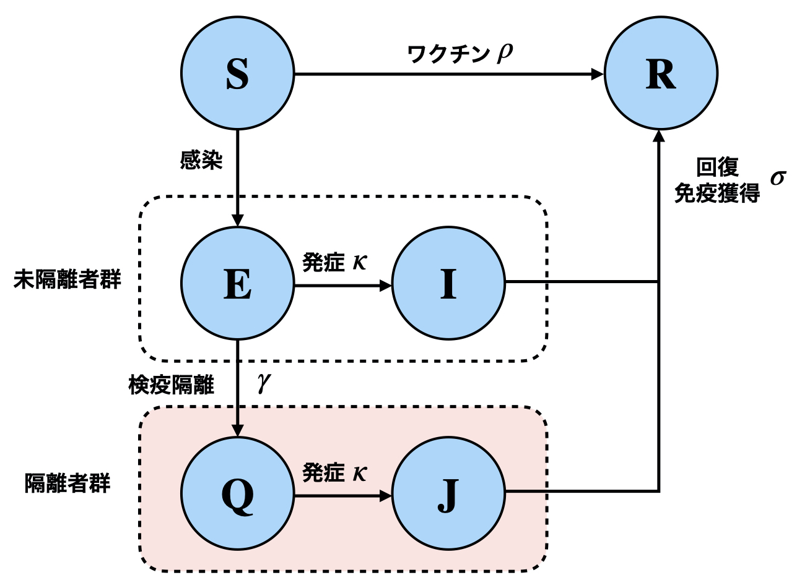

## Models

### SIR Model (Vanilla model)

### SIS Model

### SIR Model + Population Movement

### SIRS Model (SIR Model + Immune Loss)

### SIR Model + Birth + Death

### SIRD Model

### SEIS Model

### SIR-F Model

### SIQR Model

### SEIQJR Model

